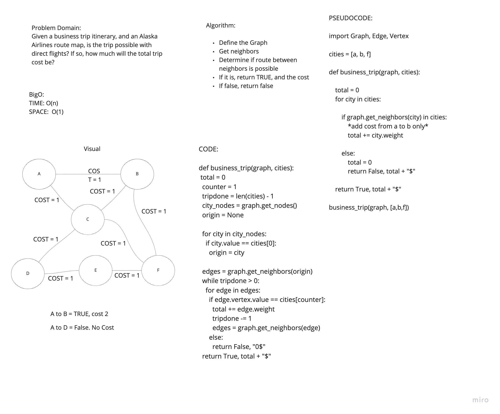

# Challenge Summary
<!-- Description of the challenge -->
- Given a business trip itinerary, and an Alaska Airlines route map, is the trip possible with direct flights? If so, how much will the total trip cost be?

## Whiteboard Process
<!-- Embedded whiteboard image -->

## Approach & Efficiency
<!-- What approach did you take? Why? What is the Big O space/time for this approach? -->
- Our approach was to find our origin and loops through its neighbors until we found our next city. Then restart the loop. Our Big O of time is (n) and space is O(1)

## Solution
<!-- Show how to run your code, and examples of it in action -->
- Solution is in test_graph_business_trip.py

## Link
- https://github.com/hgbritten/data-structures-and-algorithms/pull/41
