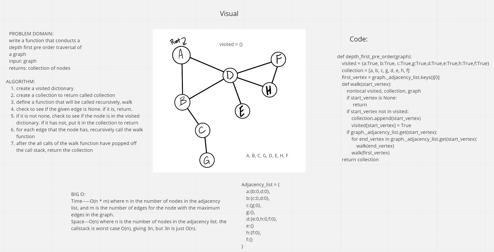

# Challenge Summary
<!-- Description of the challenge -->
- Given an adjacency list as a graph return a collection of its nodes in their pre-order depth-first traversal order

## Whiteboard Process
<!-- Embedded whiteboard image -->

## Approach & Efficiency
<!-- What approach did you take? Why? What is the Big O space/time for this approach? -->
- Our approach was to find our origin and loops through its neighbors until we found our next city. Then restart the loop. Our Big O of time is (n * m) where m is the maximum number of edges for the node with the maximum edges in the graph because the call stack can get as big as the graph we pass in depending on its structure and space is O(n)

## Solution
<!-- Show how to run your code, and examples of it in action -->
- Solution is in test_graph_depth_first.py

## Link
- https://github.com/hgbritten/data-structures-and-algorithms/pull/42
