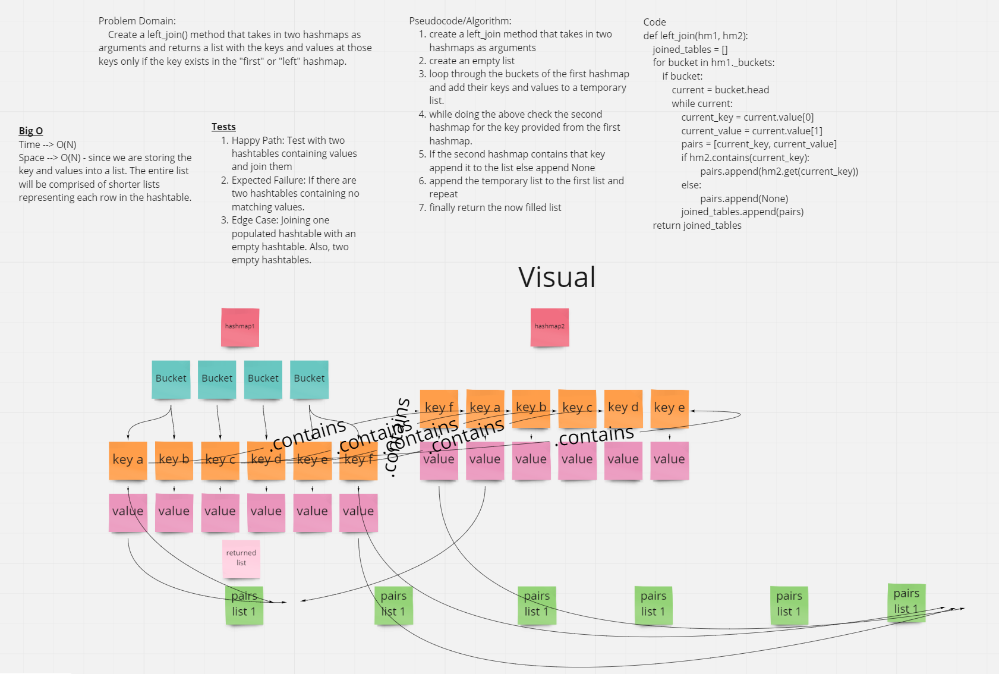

# Challenge Summary
<!-- Description of the challenge -->
- Write a function called left_join that takes in two hashmaps and returns a new list of the keys in the first hashmap and their values and the values at the same key in the right hashmap. If not found in the right hashmap append None.

## With help from
- Skyler Johnson

## Whiteboard Process
<!-- Embedded whiteboard image -->

## Approach & Efficiency
<!-- What approach did you take? Why? What is the Big O space/time for this approach? -->
- Our approach was to take in two hashmaps and loop through the first one while checking the second one for equivalency and adding the keys and values to a new list and returning the new list.

- The Big O of space is O(n) because we make a new list of keys and values and the time is also O(n) because we have to go through our hashmaps completely

## Solution
<!-- Show how to run your code, and examples of it in action -->
- Our solution is in test_hashmap_left_join.py

### Link
-
