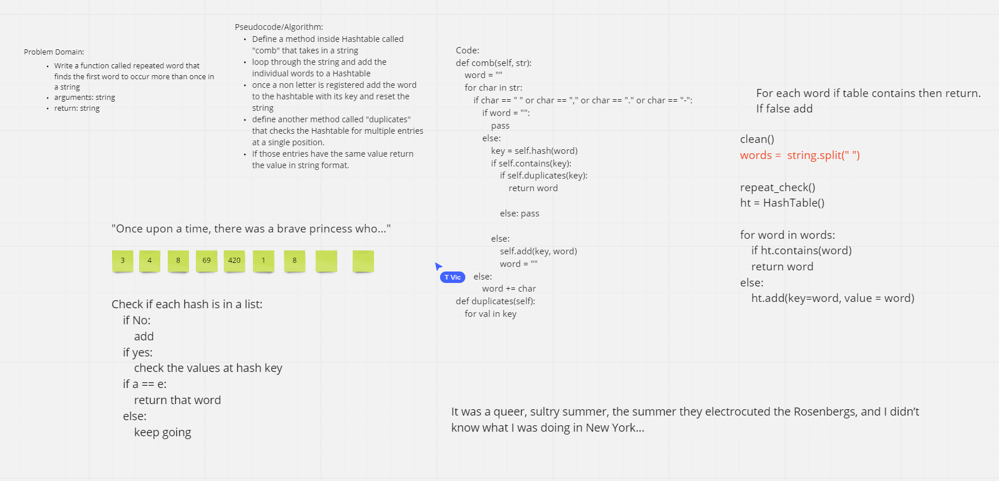

# Challenge Summary
<!-- Description of the challenge -->
- Write a function called repeated word that finds the first word to occur more than once in a string
- arguments: string
- return: string

## With help from
- Tim V.

## Whiteboard Process
<!-- Embedded whiteboard image -->

## Approach & Efficiency
<!-- What approach did you take? Why? What is the Big O space/time for this approach? -->
- Our approach was to turn the string into a list of words and pass those words into our hashtable while checking if they already existed. If they already exist we return the stringified word.
- The Big O of space is O(n) because we make a new list of words and the time is also O(n) because we could have to get all the way through our new list of words

## Solution
<!-- Show how to run your code, and examples of it in action -->
- Our solution is in test_hashmap_repeated_word.py

## Link
- https://github.com/hgbritten/data-structures-and-algorithms/pull/37
