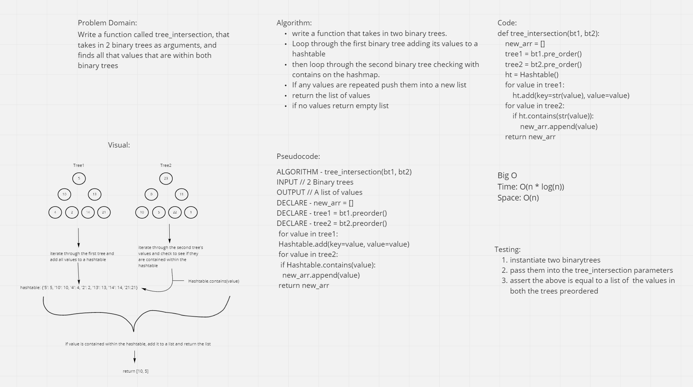

# Challenge Summary
<!-- Description of the challenge -->
- Write a function called tree_intersection that takes in two binarytrees and returns a new array of all the values that are found in both trees

## With help from
- Kyle Hoac

## Whiteboard Process
<!-- Embedded whiteboard image -->

## Approach & Efficiency
<!-- What approach did you take? Why? What is the Big O space/time for this approach? -->
- Our approach was to take in two binarytrees and make lists out of their values with pre_order. Then add all the first binarytree values into a hashmap and then check all the values against the values in the second binary tree with the .contains method and append all the values found in both to a new list

- The Big O of space is O(n) because we make a new array of values and the time is also O(n *log(n)) because we have to go through our binary trees with recursion and then go through them and add in or check all their values

## Solution
<!-- Show how to run your code, and examples of it in action -->
- Our solution is in test_hashmap_repeated_word.py

### Link
- https://github.com/hgbritten/data-structures-and-algorithms/pull/38
