# Merge Sort

##### Merge Sort is a sorting algorithm that splits a list in half until it can't anymore and compares the sorted lists to each other to put them in ascending order.

## Pseudocode

## Trace
##### Sample List: [8, 4, 23, 42, 16, 15]

### Pass 1
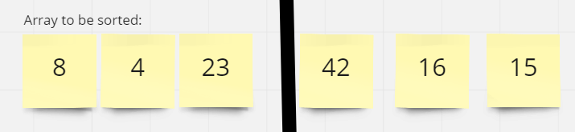

##### In the first call of the function the merge_sort(left) gets called and merge_sort(left) gets called immediately again

### Pass 2
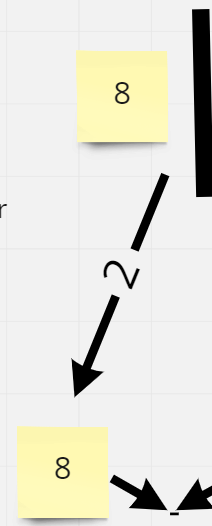

##### This call reaches base case since there is no more ways to split one number in a list

### Pass 3
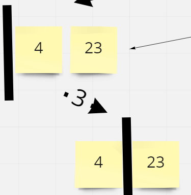

##### This call reaches our first merge sort right and since there are two parts of the list to work with it calls merge sort left again

### Pass 4
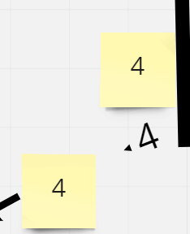

##### We have reached the base case yet again. Time to return to 4 and 23

### Pass 5
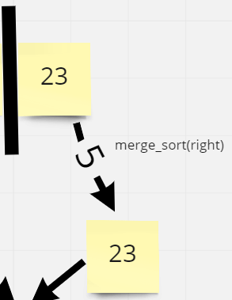

##### We merge sort right and base case for this current merge sort right call.

### Pass 6
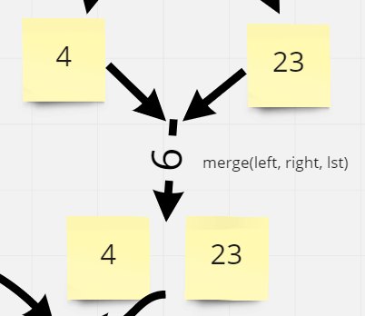

##### We move on to our first merge(left, right, lst) and our merge method places the list in the same order of 4 and 23.

### Pass 7
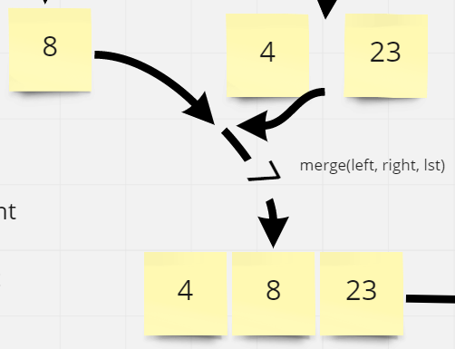

##### We are back out to our 8, 4, 23 portion and can now do another merge(left, right, lst) with left being `[8]` and right being `[4, 23]`

### Pass 8
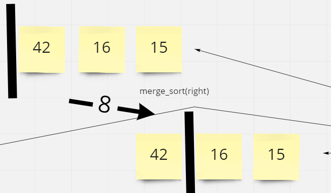

##### We have nothing on the stack besides our first merge sort call at this point and have finished the first merge_sort(left) call so we move on to our merge_sort(right).

### Pass 9
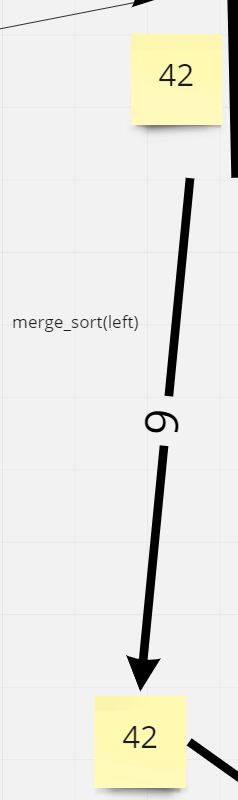

##### We call merge_sort(left) here and reach the base case for our list `[42]`

### Pass 10
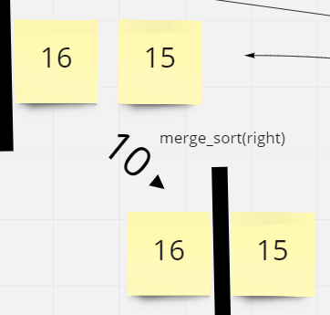

##### We move on to our merge_sort(right) and will have to call merge_sort(left) since our list is bigger than 1

### Pass 11
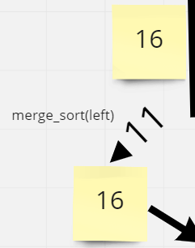

##### We call merge_sort(left) and reach base case with 16

### Pass 12
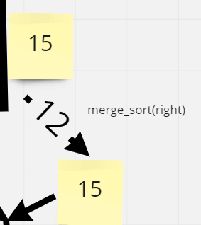

##### We call merge_sort(right) and reach our base case with 15

### Pass 13
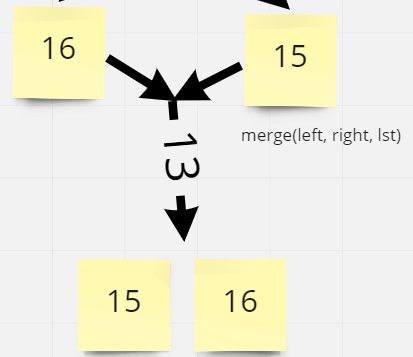

##### We then call merge(left, right, list) and pass it 16 and 15 which it will sort and return in order

### Pass 14
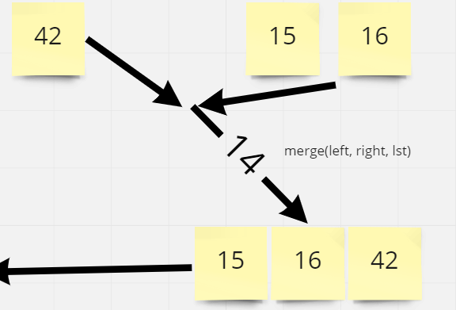

##### We have just finished our second call of merge_sort(right) for this side of the list so we move right in to merge(left, right, list) with left being 42 and right being 15, 16. 42 is bigger than 15 so 15 gets put first and it is also bigger than 16 which is put in second. It then throws 42 on the end.

### Pass 15
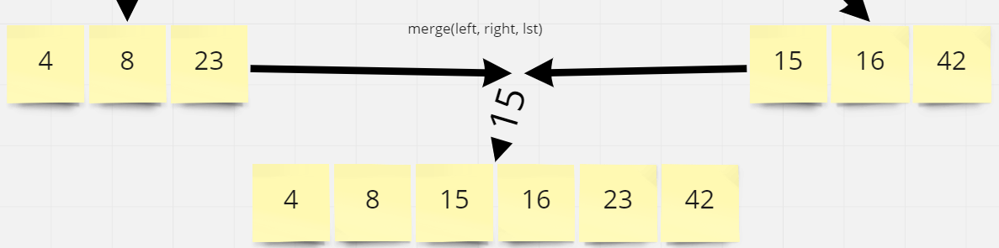

##### The final call of merge(left, right, list) with left being 4, 8, 23 and right being 15, 16, 42. The four and 15 compare and 4 is placed. The 8 and 15 compare and 8 is placed. The 23 and 15 are compared and 15 is placed. The 23 and 16 are compared and 16 is placed. Finally the 23 and 42 are compared and 23 is placed. Since 42 is left on its own it is placed to produced the merged list of 4,8,15,16,23,42

# Efficency
- Time: O(n^2)
      - The basic operation of this algorithm is comparison. This will happen n * (n-1) number of times... concluding the algorithm to be n squared.

- Space O(n)
      - Additional space is being created through the new lists. increaseing the space to O(n).

