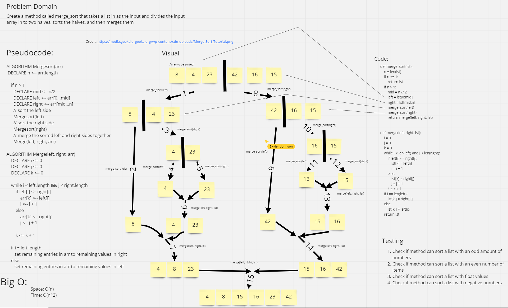

# Challenge Summary
<!-- Description of the challenge -->
- Create a merge_sort method that takes in a list and sorts it by spliting the list in half until it can no longer do so
## Whiteboard Process
<!-- Embedded whiteboard image -->

## Approach & Efficiency
<!-- What approach did you take? Why? What is the Big O space/time for this approach? -->
- We took the approach of converting the pseudocode into actual code. There is a Big O space of O(1). The Big O time is O(n^2).
## Solution
<!-- Show how to run your code, and examples of it in action -->
The code runs by passing merge_sort a list of numbers and returning them sorted in order from smallest to largest. Check out the tests in test_merge_sort.py.

## Attributions
- Kyle
- Skyler
- Tim
- Zach

# Link to PR
-
