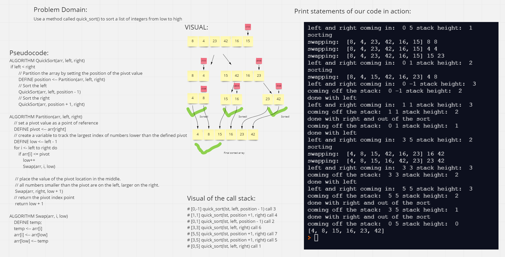

# Quick Sort

##### Quick Sort is a sorting algorithm that assigns a pivot point and moves all values greater than that pivot point to the right of itself and all the values less than itself to the left until it is completely sorted. It does this by calling itself recursively with new pivot points

## Pseudocode

## Trace
##### Sample List: [8, 4, 23, 42, 16, 15]

### Pass 1

##### In this step we declare a pivot point which is always the end of the current slice.

### Pass 2

##### In this step we have a new slice since everything greater than 15 is on the right side. 8 and 4 are left over.

### Pass 3

##### They are flipped since 8 is greater than the pivot point

### Pass 4

##### 23 is the new pivot point and only 42 is greater so 15 and 16 move off and 23 and 42 move off

### Pass 5

##### 15 and 16 are already in sorted order

### Pass 6

##### 23 and 42 are already in sorted order

### Pass 7

##### There are no more calls to make since everything is in its correct order

# Efficency
- Time: O(n* log(n))
      - The basic operation of this algorithm is comparison. This will happen n * (log(n-1)) number of times...

- Space O(log(n))
      - Additional space is being created through the call stack
