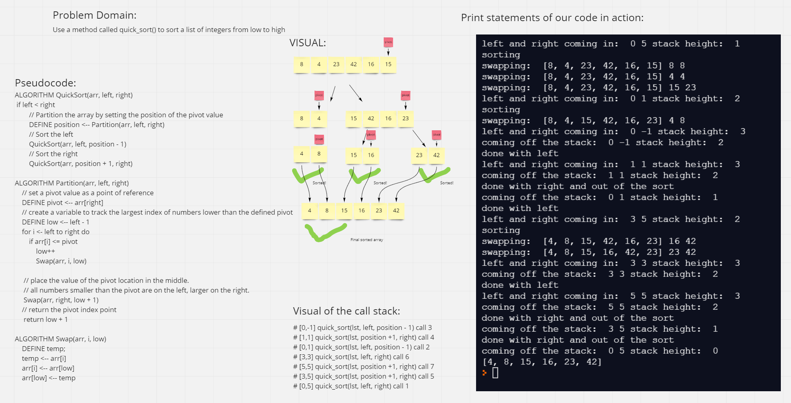

# Challenge Summary
<!-- Description of the challenge -->
- Use a method called quick_sort() to sort a list of integers from low to high

## Whiteboard Process
<!-- Embedded whiteboard image -->

## Approach & Efficiency
<!-- What approach did you take? Why? What is the Big O space/time for this approach? -->
- Our approach was to take the pseudocode and translate it into real working code. Our Big O space is O(log(n)) and Big O time is O(n * log(n))

## Solution
<!-- Show how to run your code, and examples of it in action -->
- Run the code by passing in a list of integers and the starting position and ending position of the list

## Collaborations
- Zach Hornung

## PR Link
- https://github.com/hgbritten/data-structures-and-algorithms/pull/35
